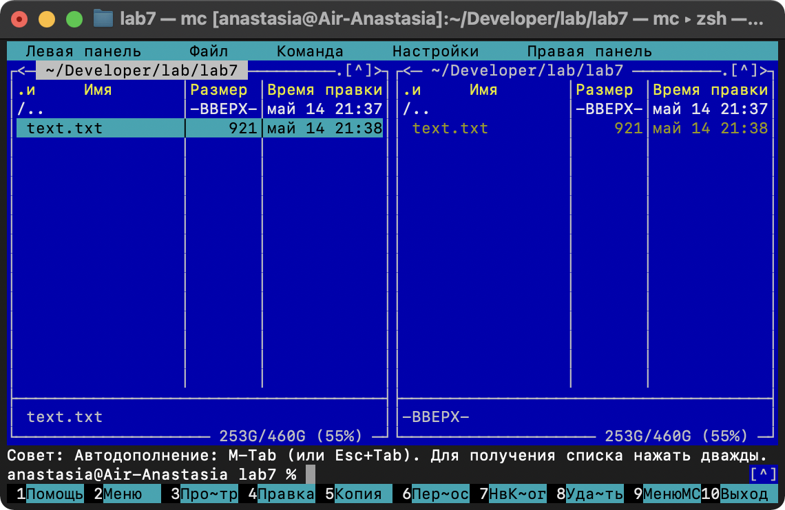
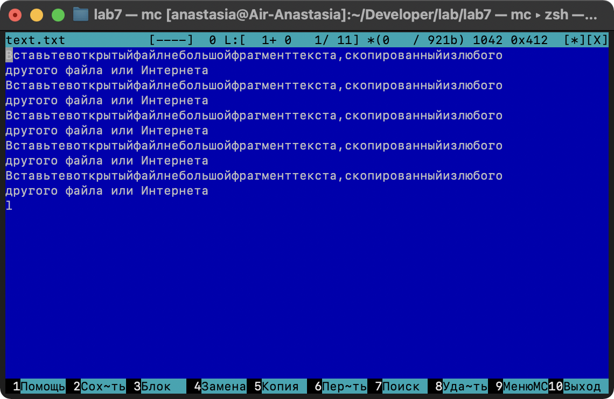
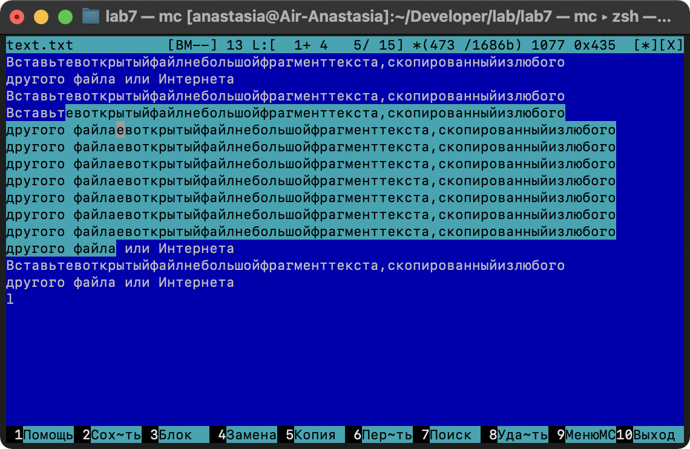
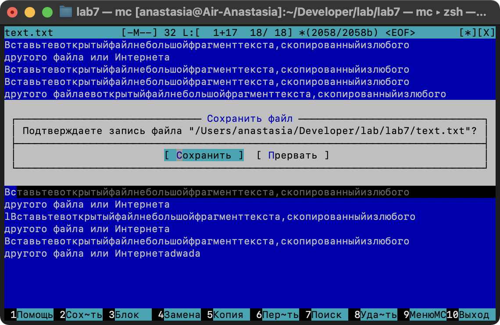
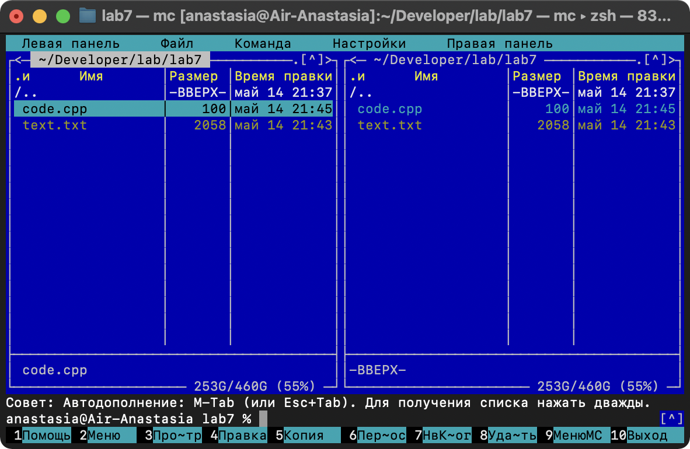
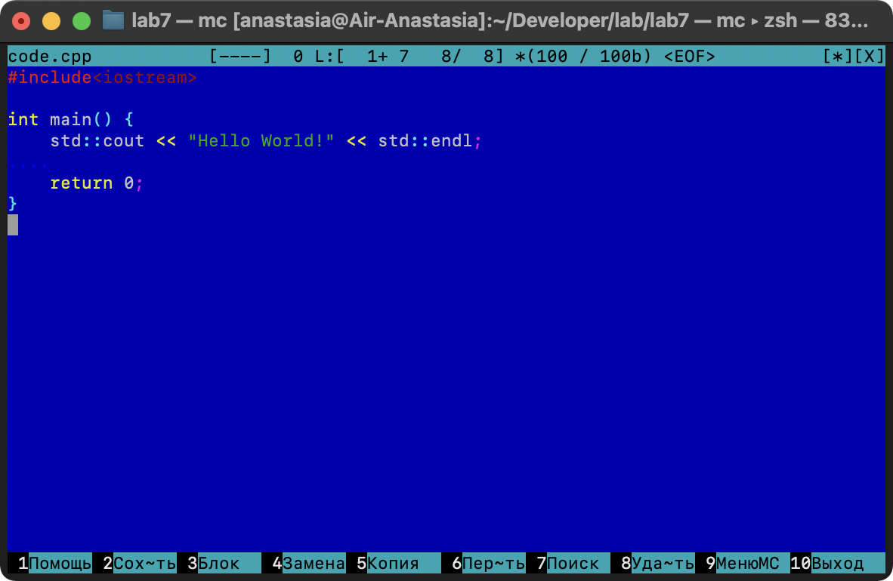
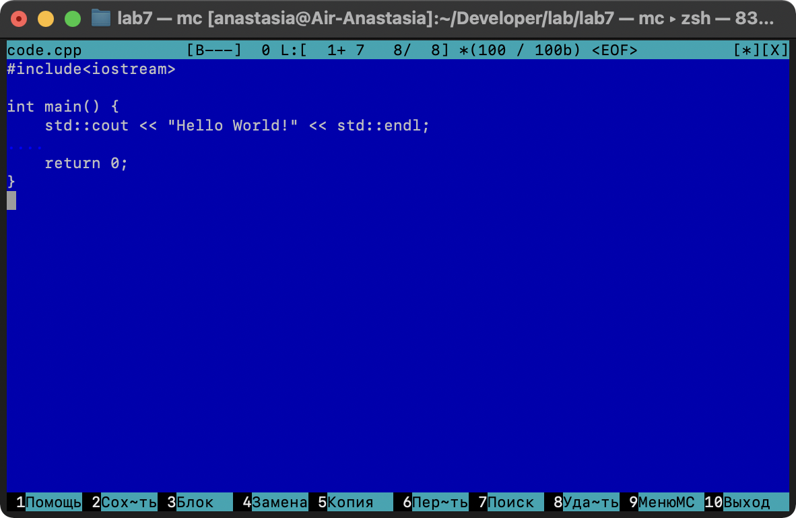

## Российский университет дружбы народов  
## Факультет физико-математический и естественных наук  
## Кафедра прикладной информатики и теории вероятностей

# Лабораторная работа № 7 « Командная оболочка Midnight Commander»

## Дисциплина
Операционные системы

## Студент
Олейник Анастасия Игоревна

## Группа
НБИбд-03-21

# Отчёт

## 1. Изучила информацию о mc, вызвав в командной строке man mc:

## 2. Запустила из командной строки mc, изучила его структуру и меню:

## 3.  Выполнила несколько операцийв mc, используя управляющие клавиши (операции с панелями; выделение/отмена выделения файлов, копирование/перемещение фай- лов, получение информации о размере и правах доступа на файлы и/или каталоги и т.п.)

## 4. Выполнила основные команды меню левой (или правой) панели: 

## 5. Используя возможности подменю Файл, выполнила:
– просмотр содержимого текстового файла;
– редактирование содержимого текстового файла (без сохранения результатов
редактирования);
– создание каталога;
– копирование в файлов в созданный каталог:

## 6. С помощью соответствующих средств подменю Команда осуществла:
– поиск в файловой системе файла с заданными условиями (например, файла
с расширением .c или .cpp, содержащего строку main);
– выбори повторение одной из предыдущих команд;
– переход в домашний каталог;
– анализ файла меню и файла расширений:

## 6. 
7. Вызовола подменю Настройки . Освойте операции, определяющие структуру экрана mc (Full screen, Double Width, Show Hidden Files и т.д.):

