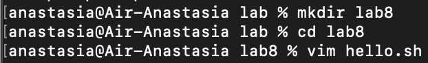
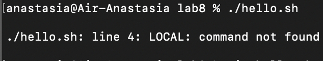
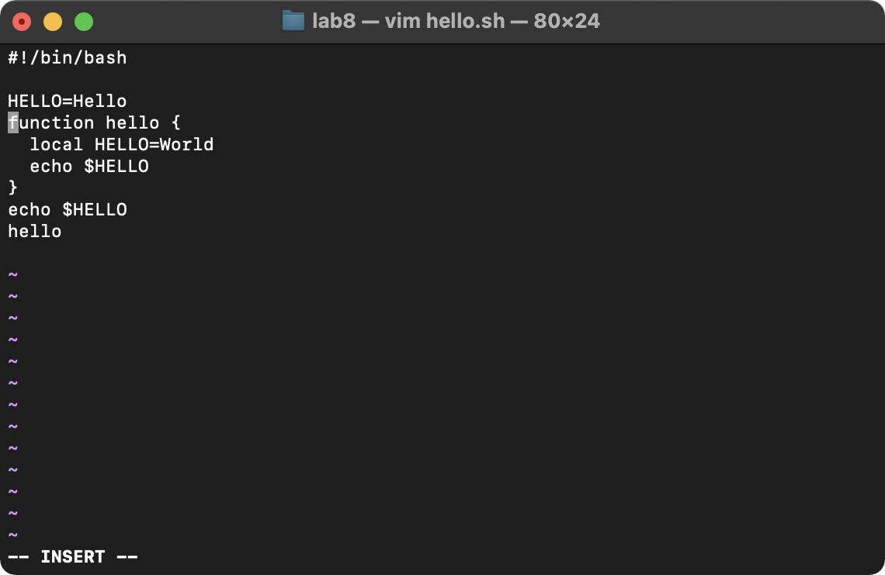
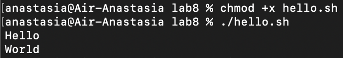

## Российский университет дружбы народов  
## Факультет физико-математический и естественных наук  
## Кафедра прикладной информатики и теории вероятностей

# Лабораторная работа №8  «Текстовой редактор vi»

## Дисциплина
Операционные системы

## Студент
Олейник Анастасия Игоревна

## Группа
НБИбд-03-21

# Отчёт
## 1. Ознакомилась с теоретическим материалом, ознакомиласься с редактором vi:

## 2.  Выполнила упражнения, используя команды vi:

